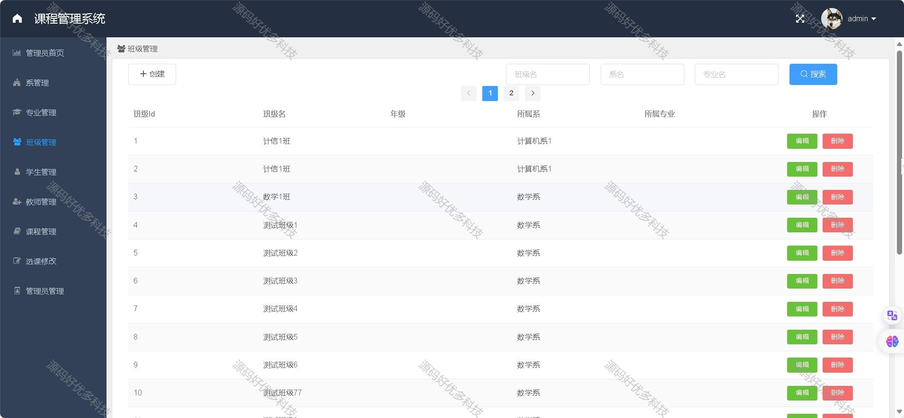

### 一、作品包含

源码+数据库+设计文档+全套环境和工具资源+部署教程

### 二、项目技术

前端技术：Html、Css、Js、Vue、Element-ui

数据库：MySQL

后端技术：Java、Spring Boot、MyBatis

### 三、运行环境

开发工具：IDEA/eclipse

数据库：MySQL8.0

数据库管理工具：Navicat10以上版本

环境配置软件： JDK1.8+Maven3.6.3

前端Nodejs：16

### 四、项目介绍

项目编号：springbootA005

随着计算机技术的飞速发展和高等教育体制改革的不断深入，传统教育管理方法、手段以及工作效率已不能适应新的发展需要，无法很好地完成教学管理工作。提高教务管理水平的主要途径是更新管理者的思想，增强对管理活动的科学认识。同时，运用先进的信息技术，开发高校综合教务管理信息系统，是深化教务体制改革的有利措施
1.管理员
班级管理、课程管理、创建课程、管理员管理、教师管理、学生管理、选课修改、院系管理、专业管理、设置用户权限等；
2.教师
成绩录入、课表查看、授课查询等；
3.学生
查看选修课程、选课、成绩查询、课表查询、个人信息修改等

### 五、运行截图

